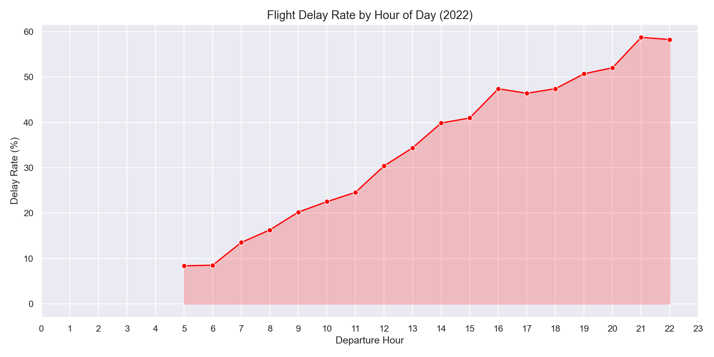
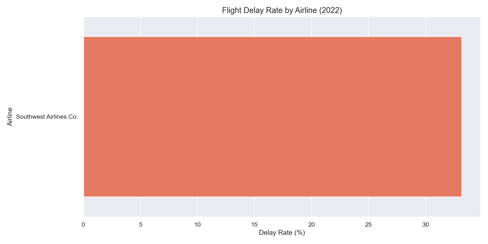
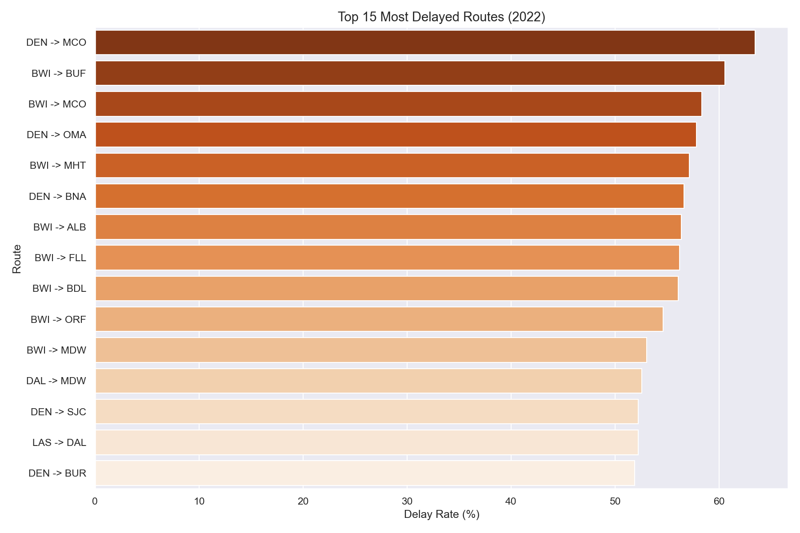
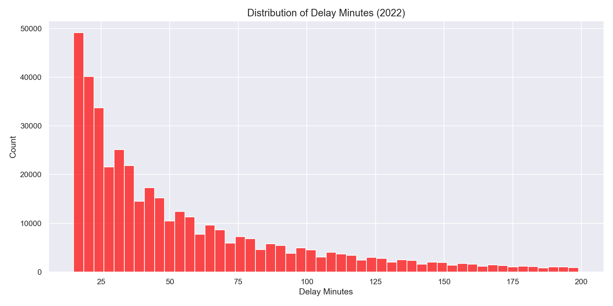

# Flight Delay Prediction

Advanced ML pipeline predicting flight delays on 2M+ BTS flight records using XGBoost, SQL analytics, and FastAPI.

## Results

| Metric | Score |
|--------|-------|
| Accuracy | 74.14% |
| ROC-AUC | 0.7006 |
| Dataset Size | 2,000,000 flights |
| Delay Rate | 21.45% |
| Tests | 4/4 passing |

## Key Insights from EDA

- **Evening flights (19:00-22:00)** have 50-58% delay rates
- **Morning flights (5:00-6:00)** only 8% delays
- **Southwest Airlines** has 33% delay rate — highest among major carriers
- **DEN→MCO route** has 63% delay rate — most delayed route
- **Summer months** (June-August) have highest delay rates

## Tech Stack

- **ML:** Python, XGBoost, scikit-learn, imbalanced-learn (SMOTE)
- **Data:** SQL queries, SQLite/PostgreSQL, pandas
- **Visualization:** Matplotlib, Seaborn
- **API:** FastAPI, Uvicorn
- **Infrastructure:** Docker, AWS

## Project Structure

```
flight-delay-prediction/
├── src/
│   ├── ingest.py        # Data loading and validation
│   ├── sql_queries.py   # SQL analytics queries
│   ├── eda.py           # Exploratory data analysis + charts
│   ├── preprocess.py    # Feature engineering + SMOTE
│   ├── train.py         # XGBoost model training
│   ├── api.py           # FastAPI REST endpoint
│   └── database.py      # PostgreSQL/SQLite logging
├── tests/
│   └── test_pipeline.py # Automated tests (4/4 passing)
├── outputs/             # EDA charts
└── requirements.txt
```

## EDA Charts

### Delay Rate by Hour


### Delay Rate by Airline


### Top Delayed Routes


### Delay Distribution


## Quick Start

```bash
git clone https://github.com/sarvagna23/flight-delay-prediction.git
cd flight-delay-prediction
python3 -m venv venv && source venv/bin/activate
pip install -r requirements.txt
# Download dataset from Kaggle: Combined_Flights_2022.csv → data/
python3 src/train.py
python3 src/api.py
```

## API Usage

```bash
curl -X POST "http://localhost:8000/predict" \
  -H "Content-Type: application/json" \
  -d '{"month": 6, "day_of_week": 5, "hour": 19, ...}'
```

## Dataset

[Flight Delay Dataset 2018-2022](https://www.kaggle.com/datasets/robikscube/flight-delay-dataset-20182022) — Kaggle